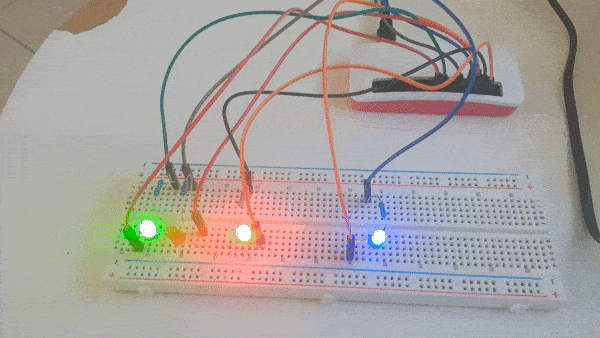

# seed_watcher
Watch the status of your seedbox.

**seed_watcher** will print on standard output different informations concerning your seed box :
  - localization status : ok if you hide your localization behind a vpn
  - download speed.

Moreover if **seed_watcher** is launch from a *raspberry pi* (whatever version having access to GPIO), the corresponding informations will be transcripted into led blinking.

If your localization is elsewhere than your country, green led will be lightning up.
Otherwise a red led will be blinking.

A blue led will blink with a frequency that is inversely proportional to the download speed.

## Installation
Just download or clone this repository :

    git clone https://github.com/hippo91/seed_watcher.git
  
Then type :

    cd seed_watcher; pip install .

An access to the seedbox through ssh need to be configured.

Moreover the seed box is supposed to run *transmission* configured in a client/server way.

## Usage

Once installed, open a terminal and type :

    seed_watcher.py

The output on your laptop/desktop will look like :

    Download speed is : 712.693359375 kB/s
    Download speed is : 678.1484375 kB/s
    Download speed is : 712.3720703125 kB/s
    Download speed is : 735.9716796875 kB/s
    Download speed is : 678.46875 kB/s
    Download speed is : 719.1435546875 kB/s
    Download speed is : 620.7158203125 kB/s
    Download speed is : 554.10546875 kB/s
    Seed box localization is : germany
    Ip address is licit : True
    Download speed is : 640.673828125 kB/s
    Download speed is : 699.798828125 kB/s
    Download speed is : 715.677734375 kB/s
    Download speed is : 673.5146484375 kB/s
    Download speed is : 686.998046875 kB/s
    Download speed is : 715.4482421875 kB/s
    Download speed is : 705.216796875 kB/s
    Seed box localization is : germany
    Ip address is licit : True
    Download speed is : 731.7890625 kB/s
    Download speed is : 666.181640625 kB/s
    Download speed is : 708.14453125 kB/s

If the program is launched from your raspberry then you will have :

## Configuration

All the configuration stands in the `config.json` file :

    {
        "seedbox-user": "*****",
        "seedbox-local-addr": "***.***.*.**",
        "transmission-rpc-url": "http://***.***.*.**:9091/transmission/rpc/",
        "transmission-username": "***********",
        "transmission-password": "***********",
        "ip-check-delay": 5,
        "forbidden-countries": ["your_country"],
        "download-speed-delay": 1,
        "pin-localization-ok": 22,
        "pin-localization-ko": 8,
        "pin-download": 7,
        "minimum-frequency": 0.5,
        "maximum-frequency": 24,
        "maximum-download-speed": 750000
    }

- seedbox-user : username to use to connect to the seedbox through ssh
- seedbox-local-addr : ip address of the seed box on local network
- transmission-rpc-url : url address to use for the transmission rpc protocol